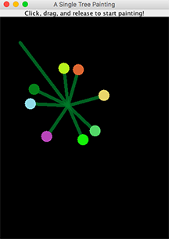
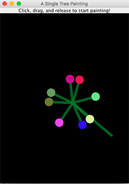

# Tree Painting

Tree Painting is a program that paints tree shapes with blossoms. [SingleTreeApplication.java](https://github.com/vantrinh7/TreePainting/blob/master/src/SingleTreeApplication.java) creates a simple tree painting application that paints a single tree. In this program, user clicks and drags anywhere on the screen to create trees with the same shape, same angle between branches, yet random blossom colors. 

 

  

 

[SeasonsTreeApplication.java](https://github.com/vantrinh7/TreePainting/blob/master/src/SeasonsTreeApplication.java) creates a collection of panels that describe different seasons, such as spring (rain effect) or winter (snow effect).

 

 

This program records the length between the mouse click point, mouse release point and a given angle to calculate the branch length. Then it utilizes a recursive algorithm to draw branches from the mouse release point (which can be modified to add more levels of branches).
